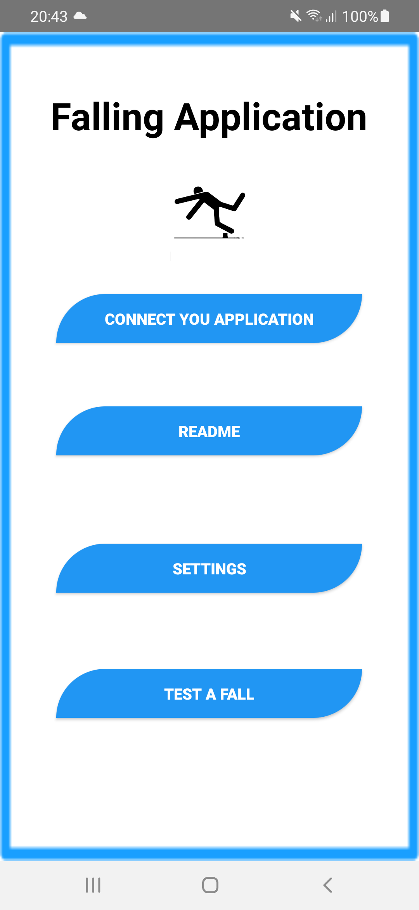
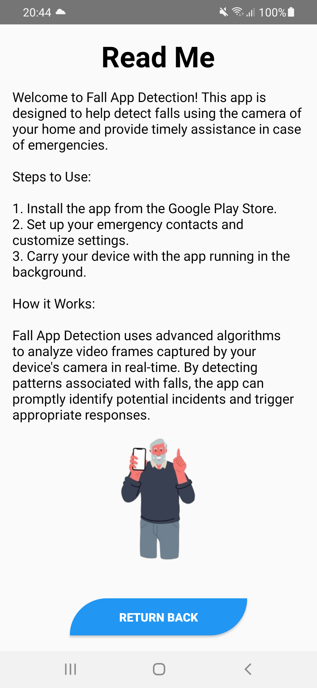
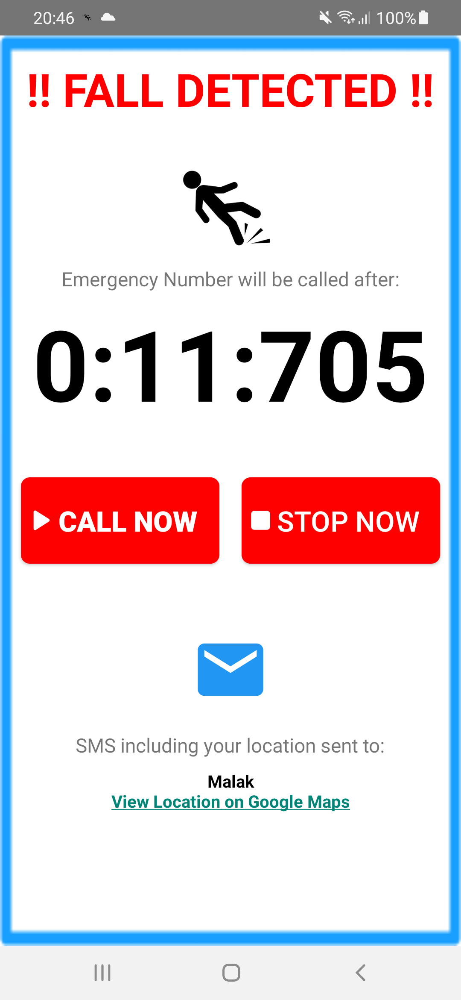
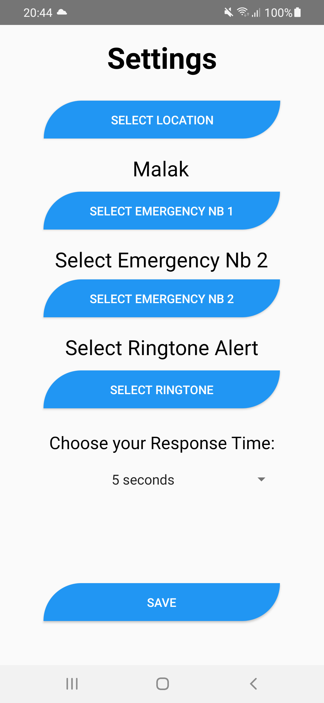

# Fall-Detection

<b>Fall detection system using computer vision techniques and mobile application development.</b> 
Key Points of the Project 🌟;
  
🔍 Advanced Fall Detection Model; Our system utilizes algorithms for fall detection.
  
📱 Seamless Mobile App Integration; The fall detection system is seamlessly linked to an application through Firebase.
  
🌍 Personalized Settings; Users have the flexibility to customize their location ringtone, emergency contacts and response time using the app.
  
🔔 Instant Alerts; In case of a fall detection the app triggers a ringtone even if the phone is set to silent.
  
📡 Real time Notifications; The app sends an SMS including users location to their emergency contact immediately.
  
📞 Emergency Calls; If there is no response within the specified time frame the app automatically calls the emergency contact number.  
 <b>Please read our report submitted above in the Documentation:Fall Detection System using Computer Vision.pdf<b>   
 ## Screenshots
 

  
  
  
  

<b>You can read our report submitted above </b>

